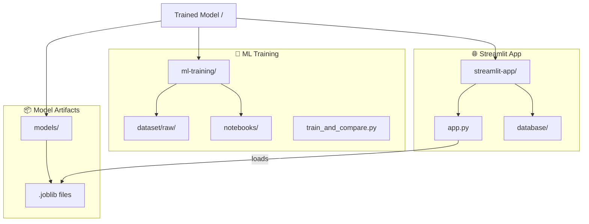

# TravelMind AI: Destination Predictor

A machine learning-powered travel recommendation system. This project is organized to separate the model training workflow from the interactive web frontend.

## 🏗️ Project Architecture

The repository follows a modular structure where training, models, and application code are decoupled:



---

## 📂 Directory Breakdown

- **`ml-training/`**: Contains the full data science workflow, including raw datasets and training scripts.
- **`models/`**: The "brain" of the app. Stores the trained `.joblib` pipelines required for predictions.
- **`streamlit-app/`**: The user interface. Built with Streamlit for a premium, interactive experience.

---

## 🚀 How to Run

### 1. Install Dependencies
Navigate to the app folder and install the required Python packages:
```bash
cd streamlit-app
pip install -r requirements.txt
```

### 2. Launch the App
Run the Streamlit server:
```bash
streamlit run app.py
```

The application will open in your default browser at `http://localhost:8501`.

---