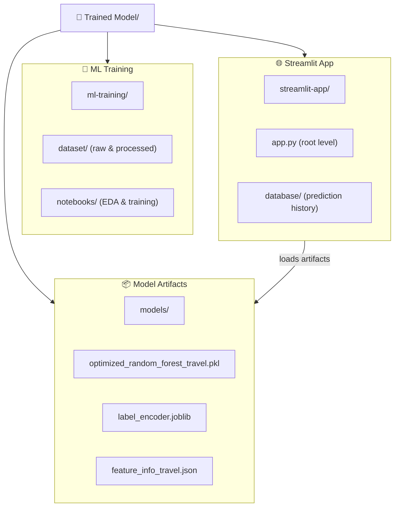

# TravelMind AI: Destination Predictor

A machine learning-powered travel recommendation system built with **Random Forest** ML model. Predicts ideal travel destinations based on traveler profiles with **77% accuracy**.

## 🏗️ Project Architecture

The repository separates model training from the interactive web frontend:



---

## 📂 Directory Breakdown

- **`ml-training/`**: Full data science workflow
  - `dataset/`: Raw and processed travel data
  - `notebooks/`: Jupyter notebooks for EDA, training, hyperparameter tuning
  - `models/`: Serialized artifacts (model, encoder, feature configs)

- **`streamlit-app/`**: Application modules
  - `model_loader.py`: Loads and manages ML artifacts
  - `schemas.py`: Data validation schemas
  - `database/db_manager.py`: SQLite prediction history tracking

- **`app.py`**: Main Streamlit application (root level)

---

## 🎯 Features

### 1. **Single Prediction** (Place Suggestions Tab)
- Enter traveler profile: Age, Gender, Budget, Travel Month
- Select travel interests: Relaxation, Adventure, Heritage & Culture, Spiritual
- Click "🚀 Predict Ideal Destination" to get top destination recommendation
- Real-time validation shows which fields are complete
- Displays confidence percentage and destination details

### 2. **Batch CSV Import** (Import CSV Tab)
- Upload CSV files with multiple traveler profiles
- Supports columns: `Age`, `Gender`, `Budget`, `TravelMonth`, `NumberOfAdults`, `NumberOfChildren`, preferences
- Processes all rows and saves predictions to database
- Download sample CSV template

### 3. **Prediction History** (History Tab)
- Automatically saves all predictions to SQLite database
- View complete prediction log with timestamps
- Clear history option

### 4. **Model Explorer**
- View all 25 destination classes
- See destination statistics (popularity, best time to visit)
- Visualize match scores and type distribution
- Display overall model accuracy (77%)

---

## 🚀 Quick Start

### 1. Install Dependencies
```bash
cd /path/to/Trained\ Model
pip install -r requirements.txt
```

### 2. Launch the App
```bash
streamlit run app.py
```

The application will open at `http://localhost:8501`

---

## 📋 Usage Examples

### Input Form Validation
- **Age**: Must be between 18-100 (valid integers only)
- **Gender**: Choose from dropdown
- **Budget**: Low / Medium / High
- **Travel Month**: January through December
- **Preferences**: Select at least one (Relaxation, Adventure, Culture, Spiritual)

Button becomes clickable only when all required fields are filled ✅

### Batch CSV Example
```csv
Name,Age,NumberOfAdults,NumberOfChildren,TravelMonth,Gender,Budget,Pref_Relaxation,Pref_Adventure,Pref_Culture,Pref_Spiritual
John Smith,25,2,0,6,Male,Medium,1,0,1,0
Sarah Johnson,30,1,1,8,Female,High,0,1,1,0
Michael Brown,45,2,2,12,Male,Low,1,1,0,0
```

---

## 🔧 Troubleshooting

### Predict Button Not Clickable
- Ensure **all 4 required fields** are filled:
  - Age (number 18-100)
  - Gender (selected from dropdown)
  - Budget (Low/Medium/High)
  - Travel Month (select from dropdown)
- Validation message shows status of each field

### Model Loading Errors
- Verify all files exist in `ml-training/models/`:
  - `optimized_random_forest_travel.pkl`
  - `label_encoder.joblib`
  - `feature_info_travel.json`
  - `preprocessor.joblib`
  - `results_dict.joblib`

### CSV Upload Issues
- Ensure CSV has required columns (exact spelling)
- Use sample template provided in-app
- Check for empty rows or invalid data types

---

## 📊 Model Details

- **Algorithm**: Random Forest Classifier
- **Training Data**: 1,510 traveler records
- **Accuracy**: 77%
- **Classes**: 25 destinations (Agra, Goa, Jaipur, etc.)
- **Features**: 14 (age groups, seasons, budget, preferences, etc.)

---

## 🛢️ Database

- **Type**: SQLite
- **Location**: `streamlit-app/database/predictions.db`
- **Tables**: Stores prediction history with timestamps
- **Auto-initialized** on first app run

---